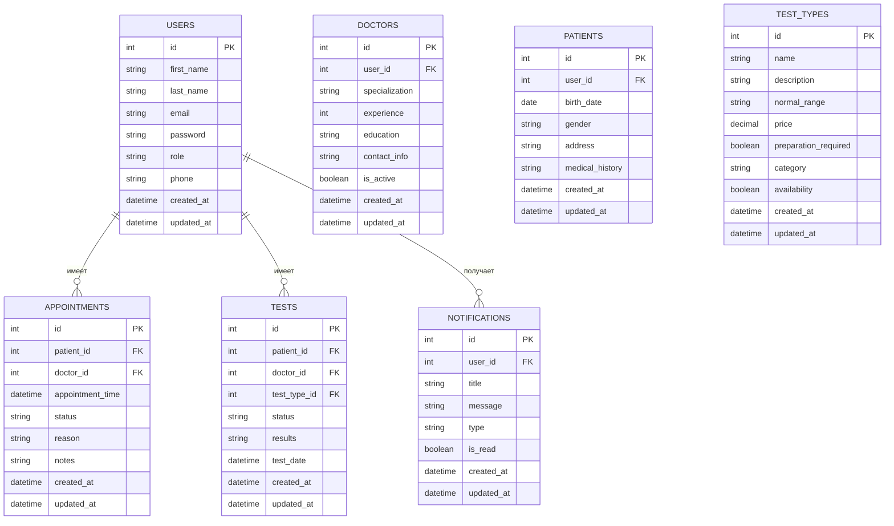
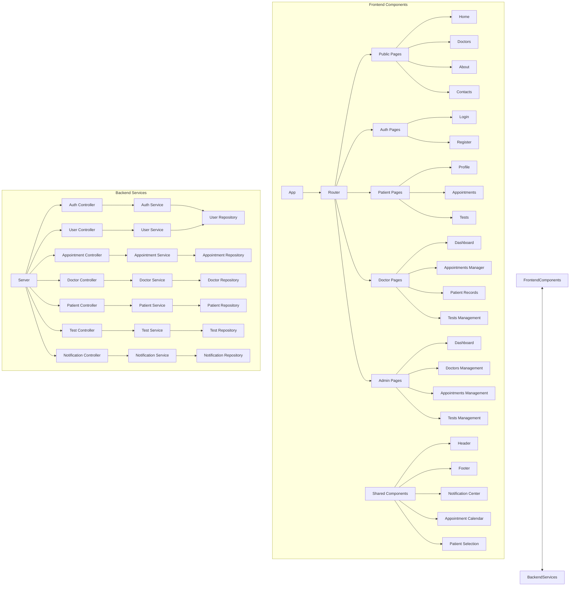
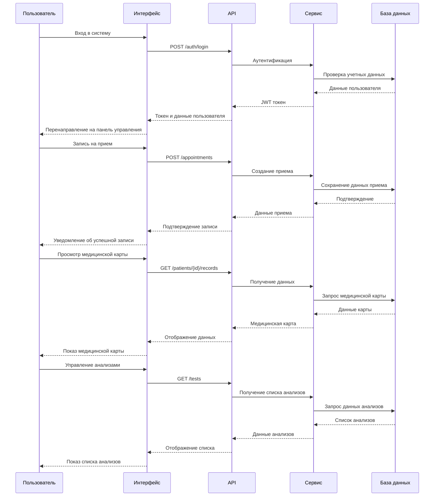
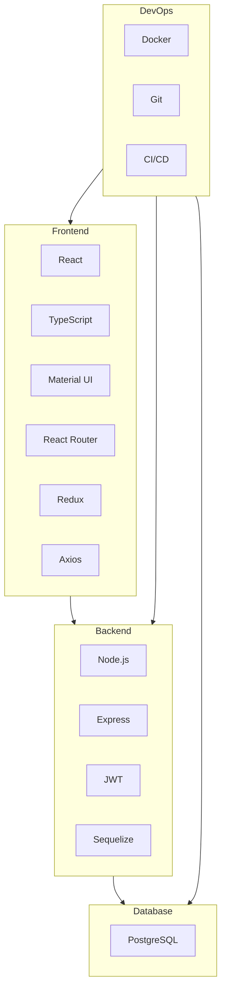

# Архитектура проекта медицинского центра

## Общая архитектура (монолитная)

```mermaid
graph TD
    subgraph "Клиентская часть (Frontend)"
        UI[Пользовательский интерфейс]
        UI --> Auth[Аутентификация]
        UI --> Patient[Пациент]
        UI --> Doctor[Врач]
        UI --> Admin[Администратор]
        
        Auth --> Login[Страница входа]
        Auth --> Register[Страница регистрации]
        
        Patient --> PatientProfile[Профиль пациента]
        Patient --> Appointments[Запись на прием]
        Patient --> Tests[Просмотр анализов]
        
        Doctor --> DoctorDashboard[Панель врача]
        DoctorDashboard --> AppointmentsManager[Управление приемами]
        DoctorDashboard --> PatientRecords[Медицинские карты]
        DoctorDashboard --> TestsManagement[Управление анализами]
        
        Admin --> AdminDashboard[Панель администратора]
        AdminDashboard --> DoctorsManagement[Управление врачами]
        AdminDashboard --> AppointmentsManagement[Управление приемами]
        AdminDashboard --> TestsManagementAdmin[Управление анализами]
    end
    
    subgraph "Серверная часть (Backend)"
        API[API сервер]
        API --> AuthService[Сервис аутентификации]
        API --> UserService[Сервис пользователей]
        API --> AppointmentService[Сервис приемов]
        API --> DoctorService[Сервис врачей]
        API --> PatientService[Сервис пациентов]
        API --> TestService[Сервис анализов]
        API --> NotificationService[Сервис уведомлений]
        
        AuthService --> JWT[JWT токены]
        UserService --> UserDB[(База данных пользователей)]
        AppointmentService --> AppointmentDB[(База данных приемов)]
        DoctorService --> DoctorDB[(База данных врачей)]
        PatientService --> PatientDB[(База данных пациентов)]
        TestService --> TestDB[(База данных анализов)]
        NotificationService --> NotificationDB[(База данных уведомлений)]
    end
    
    UI <--> API
```

## Структура базы данных

```mermaid
erDiagram
    USERS ||--o{ APPOINTMENTS : "имеет"
    USERS ||--o{ TESTS : "имеет"
    USERS ||--o{ NOTIFICATIONS : "получает"
    
    USERS {
        int id PK
        string first_name
        string last_name
        string email
        string password
        string role
        string phone
        datetime created_at
        datetime updated_at
    }
    
    DOCTORS {
        int id PK
        int user_id FK
        string specialization
        int experience
        string education
        string contact_info
        boolean is_active
        datetime created_at
        datetime updated_at
    }
    
    PATIENTS {
        int id PK
        int user_id FK
        date birth_date
        string gender
        string address
        string medical_history
        datetime created_at
        datetime updated_at
    }
    
    APPOINTMENTS {
        int id PK
        int patient_id FK
        int doctor_id FK
        datetime appointment_time
        string status
        string reason
        string notes
        datetime created_at
        datetime updated_at
    }
    
    TESTS {
        int id PK
        int patient_id FK
        int doctor_id FK
        int test_type_id FK
        string status
        string results
        datetime test_date
        datetime created_at
        datetime updated_at
    }
    
    TEST_TYPES {
        int id PK
        string name
        string description
        string normal_range
        decimal price
        boolean preparation_required
        string category
        boolean availability
        datetime created_at
        datetime updated_at
    }
    
    NOTIFICATIONS {
        int id PK
        int user_id FK
        string title
        string message
        string type
        boolean is_read
        datetime created_at
        datetime updated_at
    }
```

## Компонентная архитектура

```mermaid
graph TD
    subgraph "Frontend Components"
        App[App]
        App --> Router[Router]
        
        Router --> PublicPages[Public Pages]
        Router --> AuthPages[Auth Pages]
        Router --> PatientPages[Patient Pages]
        Router --> DoctorPages[Doctor Pages]
        Router --> AdminPages[Admin Pages]
        
        PublicPages --> Home[Home]
        PublicPages --> Doctors[Doctors]
        PublicPages --> About[About]
        PublicPages --> Contacts[Contacts]
        
        AuthPages --> Login[Login]
        AuthPages --> Register[Register]
        
        PatientPages --> PatientProfile[Profile]
        PatientPages --> Appointments[Appointments]
        PatientPages --> Tests[Tests]
        
        DoctorPages --> DoctorDashboard[Dashboard]
        DoctorPages --> AppointmentsManager[Appointments Manager]
        DoctorPages --> PatientRecords[Patient Records]
        DoctorPages --> TestsManagement[Tests Management]
        
        AdminPages --> AdminDashboard[Dashboard]
        AdminPages --> DoctorsManagement[Doctors Management]
        AdminPages --> AppointmentsManagement[Appointments Management]
        AdminPages --> TestsManagementAdmin[Tests Management]
        
        SharedComponents[Shared Components]
        SharedComponents --> Header[Header]
        SharedComponents --> Footer[Footer]
        SharedComponents --> NotificationCenter[Notification Center]
        SharedComponents --> AppointmentCalendar[Appointment Calendar]
        SharedComponents --> PatientSelection[Patient Selection]
    end
    
    subgraph "Backend Services"
        Server[Server]
        Server --> AuthController[Auth Controller]
        Server --> UserController[User Controller]
        Server --> AppointmentController[Appointment Controller]
        Server --> DoctorController[Doctor Controller]
        Server --> PatientController[Patient Controller]
        Server --> TestController[Test Controller]
        Server --> NotificationController[Notification Controller]
        
        AuthController --> AuthService[Auth Service]
        UserController --> UserService[User Service]
        AppointmentController --> AppointmentService[Appointment Service]
        DoctorController --> DoctorService[Doctor Service]
        PatientController --> PatientService[Patient Service]
        TestController --> TestService[Test Service]
        NotificationController --> NotificationService[Notification Service]
        
        AuthService --> UserRepository[User Repository]
        UserService --> UserRepository
        AppointmentService --> AppointmentRepository[Appointment Repository]
        DoctorService --> DoctorRepository[Doctor Repository]
        PatientService --> PatientRepository[Patient Repository]
        TestService --> TestRepository[Test Repository]
        NotificationService --> NotificationRepository[Notification Repository]
    end
    
    FrontendComponents <--> BackendServices
```

## Поток данных

```mermaid
sequenceDiagram
    participant User as Пользователь
    participant UI as Интерфейс
    participant API as API
    participant Service as Сервис
    participant DB as База данных
    
    User->>UI: Вход в систему
    UI->>API: POST /auth/login
    API->>Service: Аутентификация
    Service->>DB: Проверка учетных данных
    DB-->>Service: Данные пользователя
    Service-->>API: JWT токен
    API-->>UI: Токен и данные пользователя
    UI-->>User: Перенаправление на панель управления
    
    User->>UI: Запись на прием
    UI->>API: POST /appointments
    API->>Service: Создание приема
    Service->>DB: Сохранение данных приема
    DB-->>Service: Подтверждение
    Service-->>API: Данные приема
    API-->>UI: Подтверждение записи
    UI-->>User: Уведомление об успешной записи
    
    User->>UI: Просмотр медицинской карты
    UI->>API: GET /patients/{id}/records
    API->>Service: Получение данных
    Service->>DB: Запрос медицинской карты
    DB-->>Service: Данные карты
    Service-->>API: Медицинская карта
    API-->>UI: Отображение данных
    UI-->>User: Показ медицинской карты
    
    User->>UI: Управление анализами
    UI->>API: GET /tests
    API->>Service: Получение списка анализов
    Service->>DB: Запрос данных анализов
    DB-->>Service: Список анализов
    Service-->>API: Данные анализов
    API-->>UI: Отображение списка
    UI-->>User: Показ списка анализов
```

## Технологический стек

```mermaid
graph TD
    subgraph "Frontend"
        React[React]
        TypeScript[TypeScript]
        MaterialUI[Material UI]
        ReactRouter[React Router]
        Redux[Redux]
        Axios[Axios]
    end
    
    subgraph "Backend"
        NodeJS[Node.js]
        Express[Express]
        TypeScript[TypeScript]
        JWT[JWT]
        Sequelize[Sequelize]
    end
    
    subgraph "Database"
        PostgreSQL[PostgreSQL]
    end
    
    subgraph "DevOps"
        Docker[Docker]
        Git[Git]
        CI_CD[CI/CD]
    end
    
    Frontend --> Backend
    Backend --> Database
    DevOps --> Frontend
    DevOps --> Backend
    DevOps --> Database
``` 